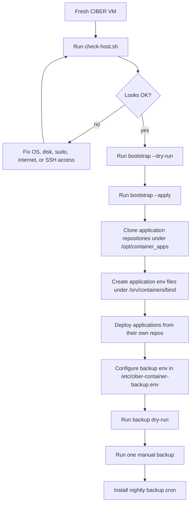

# CIBER Container Host Setup

Bootstrap and operating scripts for CIBER/ISCIII virtual machines that host
Docker-based applications.

This repository prepares the VM host only. Application deployment, reverse proxy
configuration, secrets, DNS, TLS, and application-specific Docker Compose files
belong to each application/orchestrator repository.

Do not commit secrets, database dumps, certificates, SSH keys, tokens, or real
environment files.

## Scope

The host setup covers:

- base administration packages
- Docker Engine and Docker Compose plugin
- Docker data-root under `/srv/containers/storage`
- containerd root under `/srv/containers/containerd`
- standard CIBER folders under `/opt`, `/srv`, and `/var/log/local`
- host-level backup scripts and optional cron scheduling

The setup does not publish application services. Network exposure should be
handled by the relevant application deployment.

## Target Hosts

Primary target:

- Debian minimal VM

Also supported by the bootstrap script:

- Ubuntu LTS-like systems

Expected resources for PathoCore/MEPRAM-like deployments:

- 8 CPU cores
- 16 GB RAM
- `/opt`: at least 20 GB
- `/srv`: at least 40 GB
- SSH access with a sudo-capable deployment user
- outbound internet access for packages, GitHub, and container images

RHEL-like systems are not automated yet. See `docs/rhel-notes.md`.

## Repository

Recommended upstream:

```text
https://github.com/BIPLAT-CIBERINFEC/ciber-container-host-setup
```

## Quick Start

Run the read-only host audit:

```bash
bash scripts/check-host.sh
```

Preview the bootstrap:

```bash
bash scripts/bootstrap-debian-container-host.sh --dry-run
```

Apply the bootstrap on a fresh VM:

```bash
sudo DEPLOY_USER=bioinfoadm \
  bash scripts/bootstrap-debian-container-host.sh --apply
```

Create app-specific directories in the same run:

```bash
sudo DEPLOY_USER=bioinfoadm \
  APPS="pathocore-web pathocore-api mepram-omop-api" \
  bash scripts/bootstrap-debian-container-host.sh --apply
```

## Main Scripts

| Script | Purpose | Makes changes? |
|---|---|---|
| `scripts/check-host.sh` | Read-only host audit | No |
| `scripts/bootstrap-debian-container-host.sh` | Install host packages, Docker, storage config, folders, permissions | Only with `--apply` |
| `scripts/backup-container-host.sh` | Run bind/volume/image/database backups | Yes, unless `--dry-run` |
| `scripts/install-backup-cron.sh` | Install `/etc/cron.d/ciber-container-backup` | Only with `--apply` |

## Setup Flow



## Standard Directory Layout

```text
/opt/container_apps/<APP_NAME>
/var/log/local/<APP_NAME>/apps
/var/log/local/<APP_NAME>/apache
/srv/containers/backup/<APP_NAME>
/srv/containers/bind/<APP_NAME>
/srv/containers/shared
/srv/containers/storage
/srv/containers/containerd
```

See `docs/host-layout.md` for details.

## Backups

Host-level backups are configured with:

```text
scripts/backup-container-host.sh
scripts/install-backup-cron.sh
templates/env/ciber-container-backup.example.env
```

The default schedule is daily at 02:15, with logs under:

```text
/var/log/local/container-backup
```

Before enabling backups on a VM, review the required values in
`/etc/ciber-container-backup.env`, especially `BACKUP_ROOT`,
`BACKUP_RETENTION_DAYS`, `LOG_RETENTION_DAYS`, database passwords, and
`CIBER_BACKUP_DATABASES`.

See `docs/backups.md`.

## Installed Tools

The authoritative list of host-level tools installed by the bootstrap script is:

```text
docs/tooling-inventory.md
```

Any pull request that adds, removes, or changes installed tools must update that
document or include an equivalent tools table in the PR description.

## Validation

After setup:

```bash
docker --version
docker compose version
docker info | grep -E "Docker Root Dir|Storage Driver"
systemctl status docker --no-pager
systemctl status containerd --no-pager
systemctl status cron --no-pager
```

Then run:

```bash
bash scripts/check-host.sh
```
